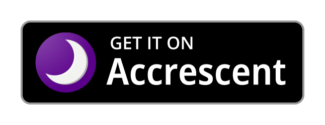
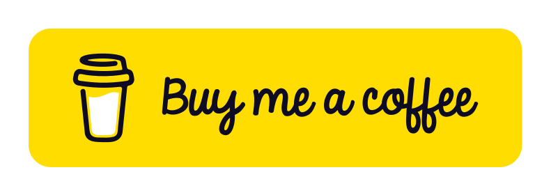
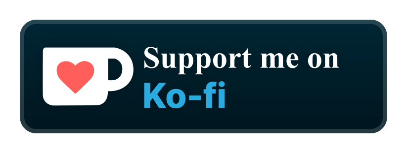

# readme-badges

Ready-to-use badges for your README.  
Feel free to use them for your repos.

- [Accrescent](#accrescent)
- [Buy Me a Coffee](#buy-me-a-coffee)
- [F-Droid](#f-droid)
- [GitHub](#github)
- [Google Play Store](#google-play-store)
- [Ko-Fi](#ko-fi)
- [PayPal](#paypal)

---

## Accrescent

**Source**: https://accrescent.app/badges/get-it-on.png

## Buy Me a Coffee

**Source**: https://studio.buymeacoffee.com/button-and-graphics

## F-Droid

**Source**: https://gitlab.com/fdroid/artwork

## GitHub

Source: https://github.com/NeoApplications/Neo-Backup/blob/034b226cea5c1b30eb4f6a6f313e4dadcbb0ece4/badge_github.png

GITHUB®, the GITHUB® logo design, the INVERTOCAT logo design, OCTOCAT®, and the OCTOCAT® logo design are trademarks of GitHub, Inc.

## Google Play Store

**Source**: https://partnermarketinghub.withgoogle.com/brands/google-play/visual-identity/badge-guidelines

Google Play is a trademark of Google LLC.

## Ko-Fi

## PayPal

**Source**: https://github.com/stefan-niedermann/paypal-donate-button
